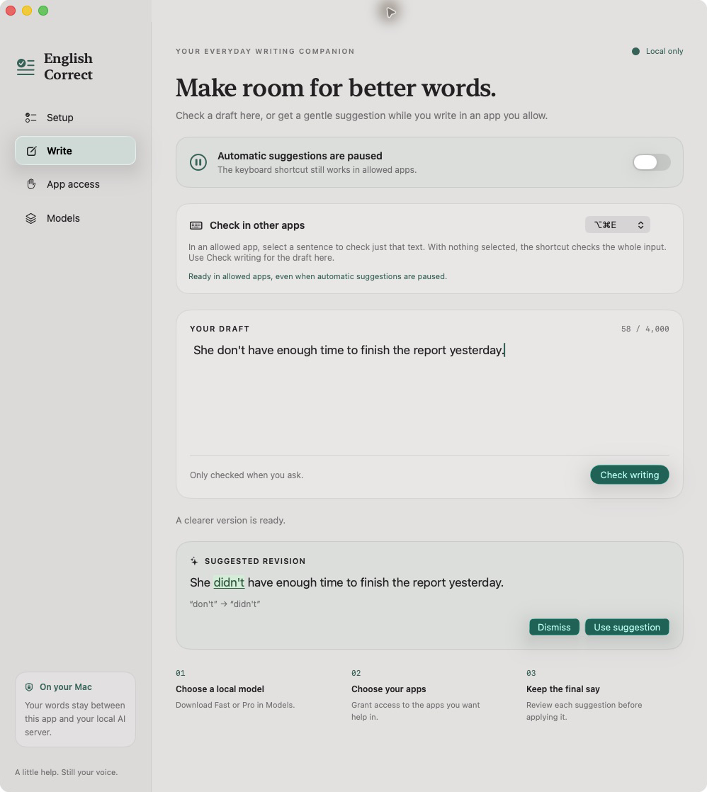
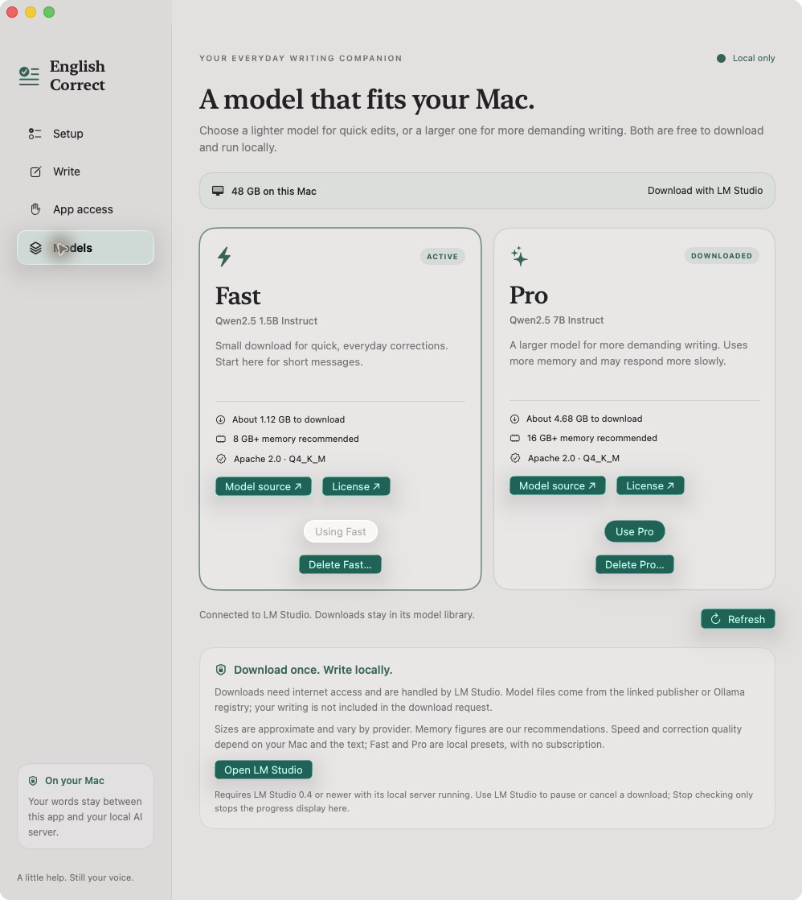
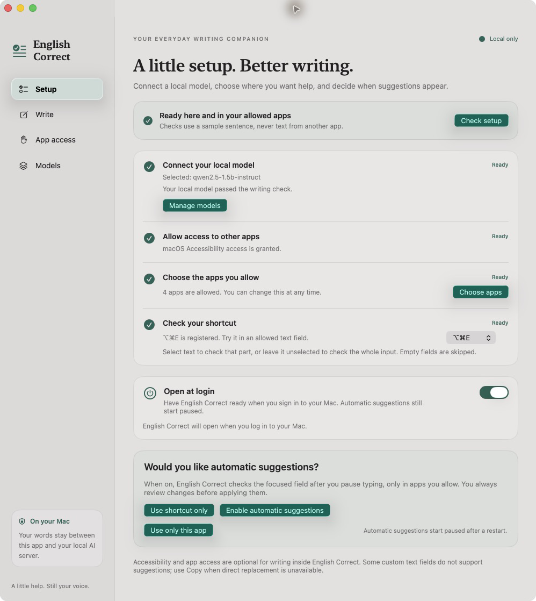
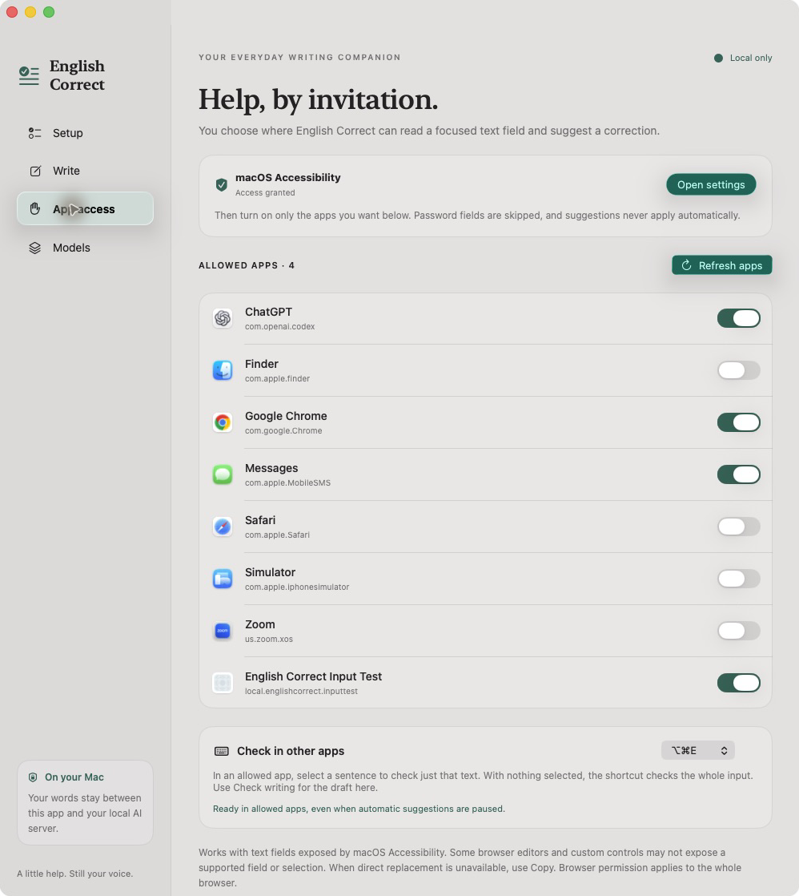

# English Correct

A native macOS writing assistant that checks English with a local AI model. Check a draft inside the app, or request a suggestion in another app you explicitly allow. You review every change before applying it.

**[Download English Correct 1.7.0 for Mac](https://github.com/HuskyCanCode/english-correct/releases/download/v1.7.0/English-Correct-1.7.0-arm64.dmg)** · [Release notes and checksums](https://github.com/HuskyCanCode/english-correct/releases/tag/v1.7.0)

Apple Silicon (M-series) · macOS 14+ · No Xcode needed to install. The installer is about **13 MB**, including the local AI engine. Fast and Pro model files download separately inside the app.



*A sample correction in Write. The original draft stays unchanged until you choose Use suggestion.*

[Get started](#get-started) · [How to use](#how-to-use) · [Troubleshooting](#troubleshooting) · [Privacy](#privacy-and-permissions) · [Tests](#build-and-test)

## Get started

### What you need

- **An Apple Silicon Mac running macOS 14 or later.** Fast is recommended for Macs with 8 GB of memory; Pro is recommended for 16 GB or more.
- Internet for the initial model download, and about 1.12 GB free space for Fast or 4.68 GB for Pro (plus temporary download space).
- **No LM Studio, Ollama, Xcode, or separate server setup is needed.** The app includes a pinned llama.cpp engine and starts it automatically.

Models are downloaded from the official Qwen repositories and verified against pinned file hashes before use. After downloading, corrections run locally without internet.

### 1. Download, install, and open

1. [Download the 1.7.0 disk image](https://github.com/HuskyCanCode/english-correct/releases/download/v1.7.0/English-Correct-1.7.0-arm64.dmg). On the release page, choose **English-Correct-1.7.0-arm64.dmg** under Assets; the source-code archives are for developers.
2. Open the downloaded `.dmg` and drag **English Correct.app** onto the **Applications** folder shortcut. If updating, quit the old app first and replace the installed copy.
3. Eject the disk image, then open **English Correct** from Applications. Keep it in that location before granting Accessibility access.
4. In Setup, open Models to download Fast or Pro. The engine is included; model files are downloaded separately.

**First-launch notice:** this release is signed with an Apple Development certificate and is **not Apple-notarized**. macOS may block it. If you trust this download, follow [Apple's instructions for opening an app that has not been notarized](https://support.apple.com/en-us/102445): after trying to open it, look in **System Settings → Privacy & Security** for **Open Anyway** and confirm the app-specific prompt. Managed Macs may not permit this. Do not disable Gatekeeper globally.

The release also includes `SHA256SUMS.txt` for checking the downloaded package.

**Setup** opens automatically on the first launch. Later launches open **Write**; you can always return to Setup from the sidebar or **English Correct → Setup Guide…**. Closing the window keeps the menu-bar app running. Choose **Quit** to stop it.

### 2. Use the built-in engine

New installations use **Built-in AI** automatically. No connection settings are needed. The app loads the model when you choose **Use Fast** or **Use Pro**, and stops its engine when you quit.

Upgrading from an older version with a selected LM Studio or Ollama model preserves that selection. To remove the external-app dependency, choose **Use built-in AI instead** in Setup or Models, then download Fast or Pro. Existing model files in other apps are not moved or deleted.

### 3. Download and select a model

In English Correct, open **Models**. Start with **Fast** if you are unsure.

| Preset | Model | Model download | Memory guidance |
| --- | --- | --- | --- |
| **Fast** | Qwen2.5 1.5B Instruct, Q4_K_M | About 1.12 GB | 8 GB+ |
| **Pro** | Qwen2.5 7B Instruct, Q4_K_M | About 4.68 GB | 16 GB+ |

1. Choose **Download Fast** or **Download Pro** and wait for completion.
2. If the card has not updated, choose **Refresh** to verify that the model is installed.
3. Choose **Use Fast** or **Use Pro**. Downloading alone does not select the model. The selected card shows **ACTIVE** and **Using Fast / Using Pro**.



*This example has both models downloaded and Fast selected. A new installation shows Download buttons instead. These screenshots show the earlier layout; version 1.7 adds the built-in AI setup card.*

Sizes are approximate. Memory figures are app guidance, not vendor minimums; speed and quality depend on hardware and text. Both models use Apache 2.0. Pro is a larger local model, not a paid tier.

### 4. Verify setup

Open **Setup**. Selecting a model starts verification automatically: **Connect your local model** changes from **Checking…** to **Ready** after a fixed sample correction succeeds. Choose **Check setup** to retry if needed. This check does not read text from another app.



*Setup reports each requirement separately. Your permission and readiness states may differ from this example.*

For writing only inside English Correct, choose **Use only this app** once the model is ready. No Accessibility permission or other-app approval is needed for that path.

### 5. Allow suggestions in other apps — optional

1. In **Setup**, choose **Open Accessibility settings**, or use **App access → Grant access**.
2. In macOS **System Settings → Privacy & Security → Accessibility**, enable **English Correct**. If it is not listed, use **+** to add the installed app. Approve any macOS prompt yourself.
3. Return to English Correct and open **App access**. Open the app you want help in, choose **Refresh apps**, and turn on only that app's switch. All apps start unapproved.
4. Return to **Setup** and confirm the model, Accessibility, allowed apps, and shortcut checks are ready. Choose **Use shortcut only** to check on demand, or **Enable automatic suggestions** to check after you pause typing.



*The macOS permission and each app's switch are separate approvals. You can revoke either at any time.*

Automatic suggestions start **paused on every launch**. Enable them again in Setup or with the switch in Write when wanted. The shortcut can still work while automatic suggestions are paused, once setup is ready. Permission loss or model changes pause automatic suggestions; successful verification never turns them on by itself.

### Optional: open at login

Choose **Enable open at login** when asked, or **Not now** to dismiss the question. You can change this later in **Setup → Open at login**. If macOS requires approval, use **Open Login Items** to finish in System Settings.

Opening at login does not grant app access or enable automatic suggestions. The built-in engine starts when the selected model is checked.

## How to use

### Check a draft inside English Correct

1. Open **Write** and enter or paste text in **Your draft**.
2. Choose **Check writing**.
3. Review **Suggested revision**. Added and changed words are highlighted in green and underlined; the edit summary also identifies removed wording.
4. Choose **Use suggestion** to update the draft, or **Dismiss** to leave it unchanged. Copy text from the writing area when finished.

### Check writing in an allowed app

1. Keep English Correct running. Its built-in engine starts automatically when needed.
2. Click an editable input in an app you have allowed.
3. **Select a sentence or passage** to check only that text. With nothing selected, the whole input is checked.
4. Press **⌥⌘E (Option–Command–E)**.
5. Review the floating suggestion. Choose **Apply** to replace the checked text, **Copy** to put the correction on the clipboard, or close the suggestion to leave your writing unchanged.

Apply is unavailable when the field cannot safely accept a replacement; use Copy and paste it yourself. Long suggestions scroll. Copy and Apply use plain corrected text without the visual highlighting. If the shortcut conflicts with another app, choose **⌃⌥⌘E (Control–Option–Command–E)** in Write, App access, or Setup.

With automatic suggestions enabled, the app checks the focused field after about **1.2 seconds** without typing, only in apps you allow. It still waits for you to apply any change.

**Empty or whitespace-only inputs stay quiet**, even when you press the shortcut. The same applies to a whitespace-only selection. Editing a checked field dismisses its stale suggestion; clearing it cancels pending work. If the text, selection, focus, or permission changes before Apply, check the current text again.

## Troubleshooting

| What you see | What to try |
| --- | --- |
| Download link shows 404 | Open the Releases page and choose the latest DMG asset. |
| macOS blocks the first launch | This development build is not notarized. Read the first-launch notice above and Apple's linked guidance. |
| Download is stuck on an older release asking for LM Studio | Install version 1.7.0, then choose **Use built-in AI instead** if shown. No separate AI app is needed. |
| Built-in engine is missing | Install the complete app from the DMG; a bare source/debug executable does not include the engine. |
| A model cannot start | Close memory-heavy apps and try Fast. Download/select a model, then use Setup → Check setup. |
| Download failed or was stopped | Check internet and free space, then choose Download again. Completed verified model files are reused; an interrupted file downloads again. |
| Legacy LM Studio connection failed | Switch to Built-in AI, or install LM Studio 0.4+, start its local server, and choose Check connection. |
| Download finished, but writing is not ready | Choose Refresh, then Use Fast/Pro. Wait for the automatic sample check to reach Ready. Download completion alone does not select a model. |
| An app is missing from App access | Open that app, then choose Refresh apps. |
| Shortcut gives permission guidance | Verify both the macOS Accessibility switch and the app's own switch in App access. Reopen the installed English Correct copy if macOS requests it. |
| Shortcut is unavailable or another app handles it | Choose the alternate shortcut and check its status in Setup. Keep English Correct running. |
| No suggestion appears for an empty field | This is expected. Type a sentence or select nonblank text first. |
| A custom editor is unsupported, or Apply is disabled | Use Copy if offered, or paste the text into Write and check it there. Password fields are skipped. |
| A suggestion disappears while you edit | The original input changed, so the app discarded the old result. Check the updated text again. |
| Automatic suggestions are paused after restarting | This is expected. Turn them on explicitly if wanted; shortcut-only use remains available after setup. |
| Accessibility stops working after rebuilding or moving the app | Quit English Correct, keep one installed copy in a stable location, and remove/re-add that copy in macOS Accessibility settings if needed. See signing notes below. |

## Privacy and permissions

- **Two approvals before another app's text is read:** macOS Accessibility access and that app's opt-in. Automatic monitoring also needs its own master switch.
- Only the foreground app's focused, supported text field is considered. Password fields are skipped. A browser approval applies across that browser's websites; there are no per-site permissions.
- With a selection, only the selected text is sent to the local model. Otherwise the whole input is sent. Fields that cannot reliably report their selection are skipped.
- The bundled engine listens only on loopback with a fresh authentication key for each launch; its web interface and prompt logs are disabled. Correction requests use a loopback-only local connection. There is no cloud fallback, telemetry, keystroke recording, clipboard polling, or saved draft history. Copy writes to the clipboard only when clicked. Legacy external model servers may have their own logging settings.
- Download requests send public model identifiers, not your writing. Initial model downloads require internet access; inference uses the downloaded model locally.
- The app saves setup/launch choices, app permissions, local AI configuration, selected model identifiers, and download-job metadata. Text and suggestions stay in memory. Opening at login is a separate, explicit choice.
- Apply rechecks permissions, app, field, selection, and exact original text before writing, then verifies the result. **Suggestions never apply automatically.**

## Compatibility and limits

Standard native text fields and plain multiline controls are supported when they expose their text and selection through Accessibility. Browser editors and custom controls vary. Whole-field replacement is plain text and may remove rich formatting; there is no simulated-paste fallback.

A correction is limited to **4,000 characters / 32,000 UTF-8 bytes**. A shorter selection can be checked within a larger field up to 100,000 UTF-16 units. The in-app Check writing button requires 3–4,000 characters.

On macOS 26+, the app uses native Liquid Glass. On macOS 14 and 15 it uses standard materials and bordered controls. Light/dark appearance, Reduce Transparency, and Increase Contrast have matching styles. Screenshots show one appearance; controls may look different on your Mac.

Review all revisions: local model output can be incorrect. Fast has been tested with live download and inference. Pro and Ollama have automated protocol tests, but a Pro download and live Ollama integration have not been verified. Real cross-app replacement through the live OS UI also remains unverified; see the full [verification scope and limitations](TEST-RESULTS.md).

<details>
<summary>Model downloads, removal, and existing Ollama configurations</summary>

Downloads never start automatically and do not change the active model. Use Fast/Pro explicitly loads and selects it. Existing selections are retained until changed.

- In LM Studio, **Stop checking** stops only English Correct's progress display; the server may continue downloading. Pause/cancel the transfer in LM Studio. **Resume checking** resumes tracking the saved job.
- A successful download is verified before it becomes selectable. Legacy external providers also require a compatible local server.
- **Delete Fast… / Delete Pro…** asks for confirmation. LM Studio unloads exact model instances and moves the official Qwen Q4_K_M files to Trash; empty Trash later to reclaim space. Ambiguous, incomplete, symlinked, or other-publisher copies must be managed in LM Studio. Deleting an active model clears the writing selection. Cancel leaves it untouched, and a deleted preset can be downloaded again.
- Legacy LM Studio/Ollama libraries are shared with other apps; deleting a model there affects them too. Built-in downloads are owned only by English Correct.

Earlier saved Ollama configurations still work with the existing provider flow. Start Ollama before use. Ollama downloads are about 986 MB for Fast and 4.7 GB for Pro; Stop download closes the pull connection, and a retry may reuse cached partial files. Deletion unloads and deletes the exact installed tag, with shared layers possibly retained. New installations use Built-in AI; there is no UI for adding a new external provider configuration.

</details>

<details>
<summary>Build signing and updates</summary>

The build script uses the single available Apple Development or Developer ID Application signing identity, if present; otherwise it uses ad-hoc signing. Set `ENGLISH_CORRECT_SIGNING_IDENTITY` to choose a specific identity, or `-` for ad-hoc signing. Signing failures stop the build.

For an update, quit the installed app, rebuild, and copy the new app to the same location. A stable certificate-backed identity can preserve Accessibility recognition. Moving the app, changing identities, or rebuilding with ad-hoc signing may require removing and re-adding it in macOS Accessibility settings. The build script verifies the signature but does not notarize the app.

</details>

## Credits and licenses

Fast and Pro use models from **Qwen / Alibaba Cloud**, released under Apache 2.0:

- [Fast: Qwen2.5 1.5B Instruct](https://huggingface.co/Qwen/Qwen2.5-1.5B-Instruct-GGUF) · [License](https://huggingface.co/Qwen/Qwen2.5-1.5B-Instruct-GGUF/blob/main/LICENSE)
- [Pro: Qwen2.5 7B Instruct](https://huggingface.co/Qwen/Qwen2.5-7B-Instruct-GGUF) · [License](https://huggingface.co/Qwen/Qwen2.5-7B-Instruct-GGUF/blob/main/LICENSE)

Open **English Correct → Credits & Licenses…**, or the same button in **About English Correct**, for attribution and full offline license text. Exact upstream revisions, hashes, and NOTICE-file checks are recorded in [Credits/Sources.json](Sources/EnglishCorrect/Resources/Credits/Sources.json). Attribution does not imply endorsement. Model weights and LM Studio/Ollama runtimes are separate downloads.

## Build and test

Building from source is optional. It requires **Xcode 26 or later**, or matching command-line tools with the macOS 26 SDK, for the native glass APIs. Install and open Xcode once, then select its command-line tools in **Xcode → Settings → Locations**. See [Apple's Xcode requirements](https://developer.apple.com/xcode/system-requirements) for the build host's required macOS version. The resulting app targets macOS 14 and later.

Clone the repository. There are no third-party Swift package dependencies:

```sh
git clone https://github.com/HuskyCanCode/english-correct.git
cd english-correct
swift test
./scripts/build-app.sh
./scripts/build-fixture.sh
```

The built app is `dist/English Correct.app`. To install your own build, quit any running copy, copy it to Applications, and open it from there. To produce release packages, run `./scripts/package-release.sh`; generated disk images and checksums are written to `dist/releases/`.

The deterministic tests use injected services and isolated preferences; they do not grant OS access or inspect personal writing. Optional live tests and recorded results are documented in [TEST-RESULTS.md](TEST-RESULTS.md).

<details>
<summary>Live-model and disposable input-fixture checks</summary>

To check production inference with synthetic samples against a running local model:

```sh
ENGLISH_CORRECT_TEST_MODEL=qwen2.5-1.5b-instruct .build/release/EnglishCorrect --test-local-ai
```

Set `ENGLISH_CORRECT_TEST_URL` and `ENGLISH_CORRECT_TEST_MODEL` for the local endpoint and exact model identifier. Add `--ollama` to the command for an existing Ollama server.

The fixture build creates `dist/English Correct Input Test.app` with disposable single-line, multiline, password, and read-only controls. Grant English Correct Accessibility permission and allow Input Test, then leave automatic suggestions paused:

1. Choose **Use whole input**, press the correction shortcut, review, and apply both sample sentences.
2. Reset, choose **Select second sentence**, and check again. Only that sentence should appear in the suggestion and change on Apply.
3. Change the text/selection or switch fields/apps during inference. The stale suggestion must be discarded.
4. Focus the password field and invoke the shortcut. No correction request should be made.
5. Revoke Input Test's permission. Shortcut checks should offer setup guidance, and automatic checks must stop.
6. Read-only fields may offer Copy when they expose supported text and selection; Apply must remain unavailable. Native labels without a text-field role may be skipped entirely.

Repeat with the browsers/editors you intend to use; their Accessibility implementations differ.

</details>

<details>
<summary>Implementation references</summary>

- [Apple Accessibility permission API](https://developer.apple.com/documentation/applicationservices/1459186-axisprocesstrustedwithoptions) and [value updates](https://developer.apple.com/documentation/applicationservices/1460434-axuielementsetattributevalue)
- [Apple Liquid Glass adoption](https://developer.apple.com/documentation/technologyoverviews/adopting-liquid-glass)
- [LM Studio structured output](https://lmstudio.ai/docs/developer/openai-compat/structured-output), [download API](https://lmstudio.ai/docs/developer/rest/download), [progress API](https://lmstudio.ai/docs/developer/rest/download-status), and [unload API](https://lmstudio.ai/docs/developer/rest/unload)
- [LM Studio model folders](https://lmstudio.ai/docs/app/advanced/import-model) and [maintainer guidance on deletion](https://github.com/lmstudio-ai/lms/issues/199)
- [Ollama generation](https://docs.ollama.com/api/generate), [pull](https://docs.ollama.com/api/pull), and [delete](https://docs.ollama.com/api/delete)

</details>

### Built-in model storage and licenses

Built-in downloads live in `~/Library/Application Support/English Correct/Models`. **Delete Fast/Pro** removes only that app-owned model, and **Download** installs it again. Model weights are not part of the DMG. The bundled llama.cpp engine is MIT-licensed; its license and upstream third-party notices are available offline in **Credits & Licenses**. The build script fetches the pinned official `b11146` Apple Silicon engine archive and verifies its SHA-256 before packaging.
